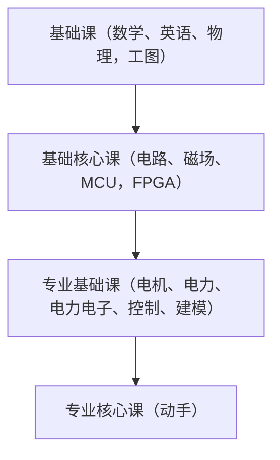

## 徐晖学长

> 18年非全日制博士，06届光电本科

### 学校、专业
1. 国网相关
   
2. 择业
   - 是否处于行业头部
   - 是否存在技术积累
  
### 行业趋势
#### 集成电路行业
- 上游：设备、材料
- 中游：制造（设计、制造、封装测试）
- 下游：市场

### 外企
- 如果环境太轻松可能会影响自己的能力发展

## 李戟珅学长

> 徐文渊老师团队

### 竞赛
- 数模
- 节能减排竞赛
- 三菱电机杯--凌云素描机器人
- 挑战杯
- 工业机器人创新项目
- 电气电子工程创新大赛

### 大二相关的竞赛
1. 节能减排竞赛--参与人数最多
   - 可能存在一些“黑幕”，比如要求含能源学生，能源老师指导，以及卡一些奇奇怪怪的东西
2. 中控杯--车为主
3. 数学建模

### 大二到大三期间--一些比较大的竞赛
1. 挑战杯
2. 互联网+

### 大三

> 比较看重学科和技术基础

1. 电设
   - 找阮秉涛老师，提供培训（比较硬核）
2. 智能车  
   - 控制+编程+硬件
   - 找韩涛老师，提供平台
3. 三菱电机杯
   - 读懂产品手册
   - 找吴敏老师，提供平台
4. 电气电子工程创新大赛

学长担任助教的课程：电机工程创新实践（大概是这个名字？）

组队中队员必要的成分
- 机械相关
- CV相关
- 电相关