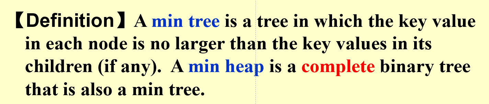
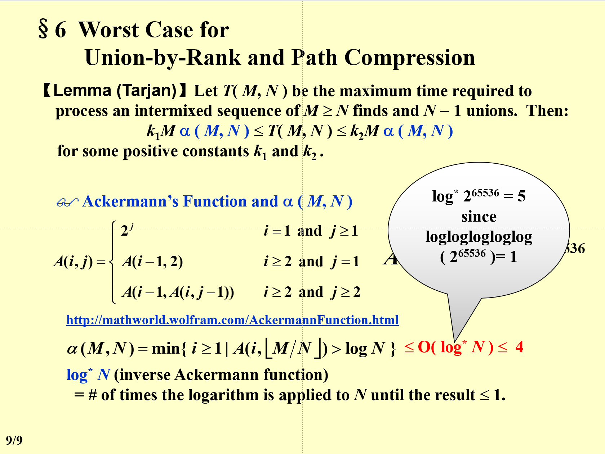
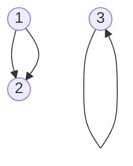
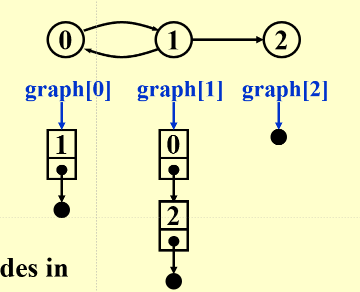

## 教材

《Data Structures and Algorithms Analysis in C》  

## 成绩构成

- 作业 10%
- 小测 10%
- 期中 15%(冬学期第二周)
- 期末 40%(都会考)
(皆为单独命题考试，内容以PPT为主)
- 大作业 30% (Hard，互评50%，助教50%) 
Bonus:发给助教，含代码和report  

## 大作业提交

  > 交两次，第一次在PR中互评，第二次在final中交给助教 

---  
## 01 What to analyze 
Time & Space complexity(machine & complier dependent)  
- $T_{avg}(N)\enspace\& \enspace T_{worst}(N)$

### 定义
- $T(N) = O(f(N))$ : if there are positive constants c and n0 such that  $T (N) \leq c \cdot f (N)$ for all $N \geq n_0$. (即上界)
- $T(N) = \Omega(g(N))$ : if there are positive constants c and n0 such that  $T (N) \geq c \cdot g (N)$ for all $N \leq n_0$. (即下界)
- $T(N) = \Theta(h(N))$ : if there are positive constants c and n0 such that  $T (N) = c \cdot h (N)$ for all $N = n_0$. (即确定性的算法，如if)
- $T(N) = o(p(N))$ : if there are positive constants c and n0 such that  $T (N) \geq c \cdot p (N)$ for all $N \leq n_0$. (无限接近不等于)

### 运算法则
- 相加：取最大
- 相乘：相乘
- 当T(N)为k阶多项式时,$T(N) = \Theta(N^k)$
- $log_k N = O(N)$，对任意的k

### 一般规则
- for循环：T = 循环内部的代码 * 循环次数
- 嵌套for循环：循环内部的代码 * 每一层循环的次数的乘积
- 顺序执行的代码：由最大的决定
- 分支语句：T = 条件判断 + 两个分支中较大的那个
```
    if (condition) S1  
    else s2
```

- 递归：
$(\frac{3}{2})^2 \leq Fib(N) \leq (\frac{5}{2})^n$


### 分治法
> 将一个n的方法变为$\frac{n}{2}$的方法

一个坑:$O(log(N)^2 )= O(N)$

---

## 02 列表，栈，队列
### 抽象数据类型（ADT）
> Data Type = { Objects } + { Operations }  

### List(Linear List)
  1. 数组实现(Sequential List)
  2. 链表  (Linked List)  
    - dummy node：头结点，不存储数据，只是为了方便操作（即表头）

### 栈：LIFO
  - 操作：Push（进栈），Pop（出栈），Top  
  
    > 从空栈中pop，或者向满栈push，都会导致出错（仅在数组实现时产生）

  1. 栈实现
     - 减少free和malloc：设置recycle bin

  - 应用之一：括号匹配
  - 
    > 用栈实现，遇到左括号入栈，遇到右括号出栈，最后栈空则匹配成功

  - 应用之二：计算器实现
  
    > 用栈实现，将中缀表达式转换为后缀表达式->计算后缀表达式

    - 表达式转换：运算符入栈  
      读入优先级$\geq$原先优先级：入栈  
      关于括号：左括号在入栈前优先级最高，在入栈后优先级最低
  
  - 应用之三：函数调用
    
### 队列：FIFO
  - 操作：Enqueue（入队），Dequeue（出队），Front（头，出队），Rear（尾，入队）
  - 循环队列：用数组实现，头尾相接，头指针指向队头，尾指针指向队尾的下一个位置
    - 判断循环队列是否已存满：
      1. 使用size变量
      2. 使用一个空间作为标记
  
---

## 03 树
### 一、属性
- 节点的度 ::= 节点的子树数量。例如，度(A) = 3，度(F) = 0。（对于二叉树，节点的度可以是0、1或2）
- 树的度 ::= 树中所有节点的最大度。例如，度(T) = 3。
- 父节点 ::= 拥有子树的节点
- 子节点 ::= 拥有父节点的节点（母节点的子树的根）
- 兄弟节点 ::= 拥有相同父节点的节点
- 叶节点 ::= 没有子树的节点
- 路径 ::= 从一个节点到另一个节点的路径（唯一的路径）
- 路径的长度 ::= 路径上边的数量
- 节点的深度 ::= 从根节点到该节点的路径长度，根节点的深度为0
- 节点的高度 ::= 从该节点到叶节点的最长路径长度
- 节点的祖先 ::= 从根节点到该节点的所有节点（a node's ancestor 不是 its parent）
- 节点的后代 ::= 从该节点到叶节点的所有节点

### 二、实现（链表）

### 三、树的遍历（四种）
  - Preorder：先访问根
  - Postorder：最后访问根
  - Level-order
  - Inorder：最先访问根  
  #### 1. 性质  
    1. 叶的顺序不变
    2. 任何数都可以转换成一个二叉树（见PPT04P06）
    3. 仅仅给出前序和后序，无法唯一确定一棵树

### 四、Inordered Threaded Bindary Trees 
  Thread == Ture:原来是一个空指针
  - 为每个节点添加一个线索，指向中序遍历的后继节点
  - 为每个节点添加一个线索，指向中序遍历的前驱节点

### 树的种类
  - 二叉树
    - BST
  - 满二叉树：全满(也是完全二叉树)
  - 完全(Complete)二叉树：除了最后一层，其他层都是满的，且最后一层的节点都靠左
    - 左子树的数量大于等于右子树（注意BST不是！）

### 五、Properties of Binary Trees
  - 对于非空树, n0 = n2 + 1 
  （n0为叶节点数，n2为度为2的节点数，即有两个子树的节点）

### 坑
- If on the 9th level of a complete binary tree (assume that the root is on the 1st level) there are 100 leaf nodes
  - 第九层的节点有100个叶节点，意味着还有第十层
  - 注意叶节点不一定最后一层，对于完全二叉树来说，也可能在倒数第二层

---

## 04 Binary Search Tree

  > 正序：increasing order

### 性质  

  - 左子树的所有节点的值均小于根节点的值，右子树的所有节点的值均大于根节点的值
  - 键值全为整数且不同
  - 查找操作：T(N) = O(d)，其中d是树的深度。
  - 插入操作
  - 删除操作：
    1. 删除叶子节点：将其父节点的链接设置为NULL。
    2. 删除度为1的节点：用其唯一的子节点替换该节点。
    3. 删除度为2的节点：
     - 步骤1：用左子树中最大的节点或右子树中最小的节点替换该节。
     - 步骤2：从子树中删除替换的节点。
  - 最好情况：O(logN)，当树为完全二叉树时。
  - 最坏情况：O(N)，当树类似链表时。


### 操作
- 插入
  - 从根节点开始，比较插入值和节点值的大小
  - 不会删除原有节点
  - 树的高度和插入顺序有关

- 删除
  - 叶子节点：直接删除，将其父节点的链接设置为NULL，再free它
  - 度为1的节点：将其值替换成他的子节点，再free它的子节点
  - 度为2的节点：用左子树中最大的节点或右子树中最小的节点替换该节点，再free该子节点（注意是左子树而不是左子节点）

### 时间复杂度分析
对于比较平衡的BST来说，插入和删除的时间复杂度都是O(logN)。但是，如果插入的顺序是有序的，那么BST就会退化成链表，此时插入和删除的时间复杂度都是O(N)。

---

## 04 堆 (Priotiry Queues)
### 一、操作
  - 插入
  - 删除
  
### 二、二分堆(Binary Heap == Binary Queue)
#### 1.结构特性
  - 完全二叉树
  
  ```mermaid
  graph TD
  A((1))-->B((2))
  A-->C((3))
  B-->D((4))
  B-->E((5))
  C-->F((6))
  C-->G((7))
  D-->H((8))
  D-->I((9))
  ```
  - 任意节点的值大于其子节点的值
  - 任意节点的值小于其父节点的值

  - 用数组实现
    - 从1开始编号，0不使用
    - 对于某个节点：（若结果符合条件，否则就说明没有）（这个性质成立的必要条件是coplete binary tree）
      - 父节点编号为\[i/2\](对于某个节点)
      - 左子节点编号为2i
      - 右子节点编号为2i+1
#### 2.顺序特性
  
  min tree:父节点小于等于子节点，最小在树根（注意这里左节点不一定小于右节点）

#### 3.基础堆操作：基于上面的要求，完成目的           
  1. Insert（向上置换）
  2. DeleteMin（向下置换）
  3. BuildHeap
     - 从最后一个非叶节点开始，percolate down<mark>(注意不是从根节点开始一个一个插入)<mark>
     - 复杂度：O(N)
  4. 最小树转最大树
    - 根据最小堆的输出，再建一个堆即可，消耗O(N)的时间

---

## 05 Disjoint Sets 并查集
### 1.等价关系R
> 定义在集合上的关系
  - Reflexive 自反性：$aRa$
  - Symmetric 对称性：$aRb\ \Leftrightarrow \ bRa$
  - Transitive 传递性：$aRb \wedge bRc \Rightarrow aRc$
### 2.动态等价关系

### 3.基本操作

  > 并查的过程，就是将本身分散的节点之间建立联系的过程

  1. MakeSet(x)：建立一个新的集合，该集合中只包含元素x
  2. Set Union(x,y)：将包含元素x和y的两个集合合并成一个新的集合
     - $S_1 \cup S_2：以S_1的根为根$（谁在后边，改的就是谁的根）
  3. Find(x)：找到包含元素x的集合的名字

### 4.实现
  1. 数组实现：S[Elements]= The element's parent
     - S[0]不使用
     > 在这里，我们假定S是一个数组，数组的下标是元素的名字，数组的值是元素的父节点的名字。对于根节点的元素，可以有多种表示方法，比如0，-size等等。注意S表示的是所有元素（森林），其中可以有很多棵树（集合）

     > S[Root] = 0 （可能有好多个Root）

     ```
     SetType  Find ( ElementType X, DisjSet S ){
         for ( ; S[X] > 0; X = S[X] ) ;
     return  X ;
     }
     ```

  2. 链表实现

### 5.Smart Union Algorithms
  - Union by Size
  
    > S[Root] = -Size

    此时有$Height < \lfloor log(N) \rfloor+1$

  - Union by Height

  这些手段都是针对“并”这个过程来说的。举个例子，以按大小合并为例，当我们要合并两个集合时，我们可以先判断两个集合的大小，然后将小的集合合并到大的集合中，这样就可以保证树的高度不会太高，从而提高Find的效率。


### 6.路径压缩
  > 在Find的过程中，将路径上的所有节点也顺便都连接到根节点上
  - 和Size Union一起使用
  - 和Height Union一起使用：Union by Rank(Estimated Height)
  最差情形：  

### 0位不使用的ADT
  - 并查集
  - 二分堆（0作哨兵节点）
  - 带dummy node的链表


---以上为期中考试内容---
期中题型
判断、选择、程序填空、函数，60分钟

---

## 排序

> 默认升序

### 堆排序
- 不断删除最小值，直到堆为空
- 复杂度：O(NlogN)


---

## 06 图论
### 1.图的定义
  - 顶点集V
  - 边集E
  - 有向图：有向边（圆括号）
  - 无向图：无向边<尖括号>
  - 限制
    - 不能自身指向自身
    - 不能重复  
错误示例：

  - 完全图：任意两个顶点之间都有边
  - 简单路径：路径上的顶点不重复
  - 环：起点和终点相同的路径
  - Component of a undirected：极大连通子图
  - 树
  - DAG:有向无环图
  - 弱联通：去掉所有的有向边的方向后，得到的无向图是连通的
  - 强连通：任意两个顶点之间都有路径（包括单个节点）
  - 度degree：与该顶点相关联的边的数目
  ```mermaid
  graph TD
  A((1))-->B((2))
  A-->C((3))
  D((4))-->A
  ```
  对于A:Indergree = 1,Outdegree = 2,degree = 3
  - 图的邻接矩阵：$A_{ij} = 1$，表示从i到j有一条边

### 邻接表(adjacency list)：以链表来表示关系

  - 出度计算：作邻接表，计算表有几个节点
  - 入度计算：作逆邻接表，计算表有几个节点

### Adjacenty Multilist

### 带权表

### 拓扑排序
  - 有向无环图
  - 不是真正的排序，而是生成一个符合顺序的序列
  - 时间复杂度：O(V+E)
  - 应用：
    - 判断有没有环
    - 依赖关系

### 最短路
#### 不带权最短路--广度优先搜索
#### 带权最短路（无负权时）--Djikstra's Algorithm
#### 带负权最短路
#### 有向无环图(DAG)的最短路--拓扑排序
- [关于虚拟活动](https://theconstructor.org/construction/dummy-activity-network-analysis/31502/)

### 网络流问题：需要学会计算和分析复杂度

### 最小生成树(minimum spanning tree)
#### 生成树
  - 包含原图上所有顶点的树（对于某个（带权）无向图来说）
  - 点是原来的点，边是原来的边
  - 要求：图是连通的
  - 最小生成树：使各边权重之和最小的生成树

---

## DFS

### 欧拉回路
#### 欧拉回路定义：
  - 从一个点出发，（不重复地）经过所有边，再回到出发点
#### 欧拉回路存在条件：
  - 所有点的度均为偶数

#### 更弱一点的条件：Euler Tour
  - 有且仅有两个点的度为奇数，此时可不重复地经过所有边，但不一定要回到出发点

### 哈密顿回路
  - 从一个点出发，（不重复地）经过所有点，再回到出发点（不一定要经过所有边）

---

## 排序
### 概念
- 内部排序：待排序的记录存放在内存中
- 外部排序：待排序的记录存放在外存中

### 插入排序
  - 任何通过交换相邻元素进行排序的算法(Simple Sorting Algorithm)都可以通过平均复杂度z至少为$\Omega (N^2)$
    - 证明：假设有n个元素，每次交换都会减少一个逆序对（至少插排不会增加逆序对），而逆序对的数量平均为$\frac{n(n-1)}{4}$，因此至少需要$\Omega (N^2)$次交换
  
### 希尔排序
- 分组策略：$h_1 = \lfloor N/2 \rfloor,h_{k+1} = \lfloor h_k/2 \rfloor$ （这里$h_1$代表的是第一次分组的间隔）
#### Hibbard's increment sequence
- $h_k = 2^k-1$
- 时间复杂度：$O(N^{3/2})$
  - 平均：$O(N^{5/4})$
  - 最好：$O(N)$

#### Sedgewick's increment sequence
- $h_k = 4^k+3*2^{k-1}+1$
- 时间复杂度：$O(N^{4/3})$
  - 平均：$O(N^{7/6})$
  - 最好：$O(N)$

### 堆排序

---

## Hashing

--- 

坑：
- Growing Speed：不管常数e.g $Nlog(N^2) = Nlog(N^3)$
- parent的parent不是parent了
- 快排时，若pivot在边角，则会少一个位置正确的项
- union(a,b)：把b并到a里面(如果不考虑unionbysize的话)